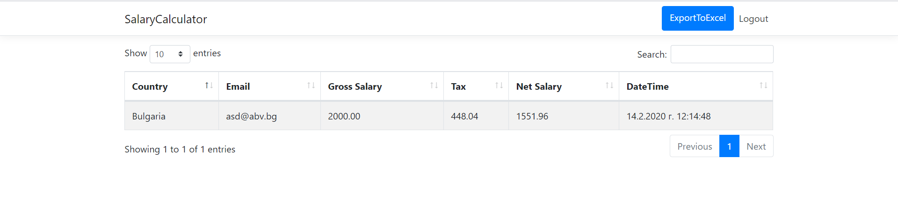

# Employee Salary Calculator

### Project Purpose

Develop a website that provides salary calculator functionality. End users should be able to calculate their net salary (in Bulgaria, Germany or USA) by submitting their gross salary and their email. The system should persist/log all salary checks. Power users should be able to export the salary check report in Excel. 

#### Technologies used: 
   - .NET Core 2.2
   - Entity Framework Core 2.2.6
   - SQL Server 
   - Visual Studio 2019 Community
   - HTML/CSS 
   - Razor engine
   - Bootstrap
   - Serilog
   - JavaScript

#### Features

Employee Salary Calculator has public and private part.

The public part of the application is visible for the users without any authentication:
homePage.png 

They can calculate their net salary in Bulgaria, USA and Germany:
calculate.png 

The private part of the application is visible only for power user.
Power user have permissions to export the salary check report.
report.png 

#### Credentials:

Username: admin
Password: admin123